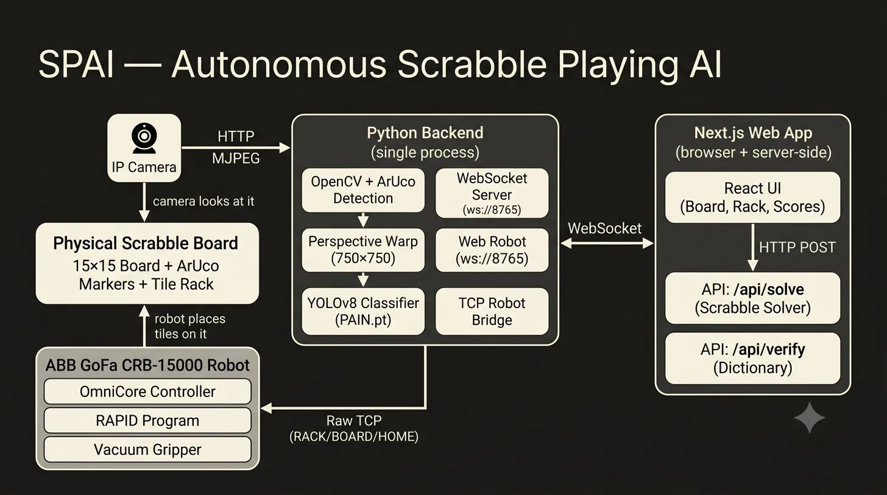

# SPAI — Autonomous Scrabble Playing AI

An end-to-end autonomous Turkish Scrabble system that uses computer vision (YOLOv8) to read a physical board, a DAWG/trie-based solver to compute the highest-scoring move, and an ABB GoFa CRB-15000 robot arm to physically pick and place tiles.

---

## System Architecture



---

## Repositories

| Repo | Description |
|------|-------------|
| [**scrabble**](https://github.com/COM0403-Scrabble/scrabble) | Python backend: computer vision pipeline (OpenCV + ArUco + YOLOv8), WebSocket server, and TCP robot bridge. Also contains the ABB RAPID robot program (`MainModule.mod`). |
| [**website**](https://github.com/COM0403-Scrabble/website) | Next.js web application: interactive game UI, Turkish Scrabble solver API (`@scrabble-solver`), dictionary verification, and robot command sequencing. |

---

## Tech Stack

| Layer | Technologies |
|-------|-------------|
| **Vision** | OpenCV, ArUco markers, YOLOv8 (Ultralytics) |
| **Game AI** | `@scrabble-solver` (DAWG/trie), Turkish dictionary |
| **Web** | Next.js 16, React 19, TypeScript, Tailwind CSS |
| **Robot** | ABB GoFa CRB-15000, RAPID, OmniCore controller |
| **Communication** | WebSocket (browser ↔ Python), Raw TCP (Python ↔ robot) |

---

## Quick Start

> Run each step in order — the robot must be ready before the Python backend connects to it.

**1. Start the RAPID program on the robot controller**
```
// On the OmniCore FlexPendant, load and start MainModule.mod
// Robot listens for TCP commands on <ROBOT_IP>:<ROBOT_PORT>
```

**2. Run the Python backend**
```bash
pip install -r requirements.txt
python main.py
# WebSocket server starts on ws://localhost:<WS_PORT>
# TCP bridge connects to <ROBOT_IP>:<ROBOT_PORT>
# Camera feed opens from <CAMERA_URL>
```

**3. Run the web app**
```bash
cd website
npm install
npm run dev
```

**4. Open the app**
```
http://localhost:3000
```
